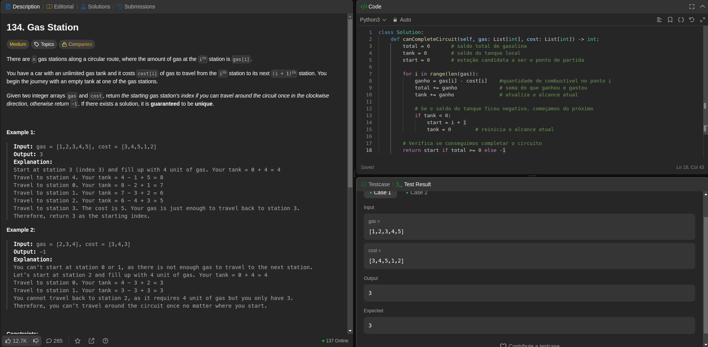
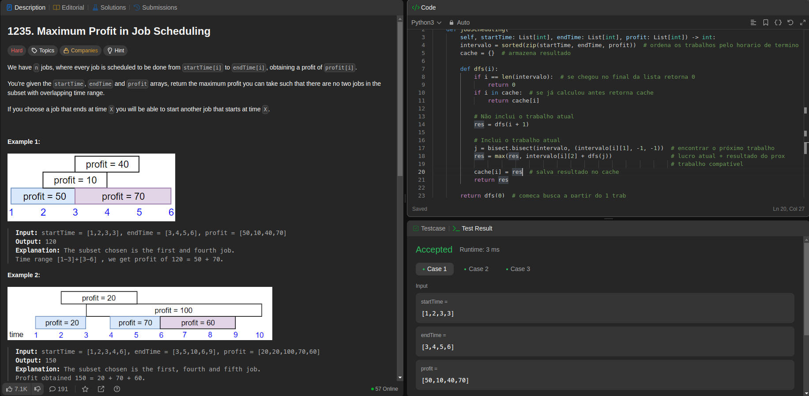
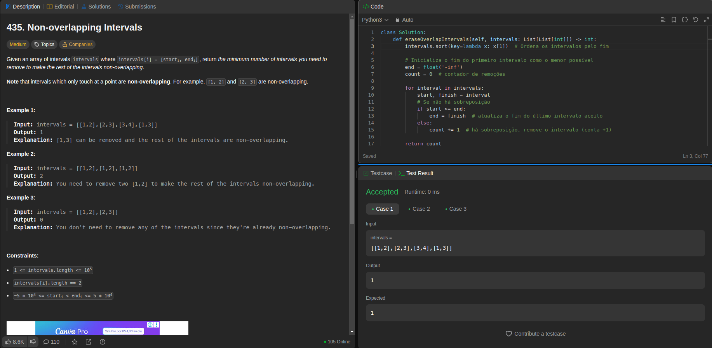

# Greed--leetcode

**Número da Lista**: 3 
**Conteúdo da Disciplina**: Greed 

## Alunos
|Matrícula | Aluno |
| -- | -- |
| 22/1022506  |  Cayo Felipe Alencar Câmara |
| 19/0028963  |  Guilherme Brito de Souza |

## Sobre 
Foram realizadas 4 questões do leetcode sobre algoritmos ambiciosos.

| Problema | Nome                                   | Dificuldade |
|----------|----------------------------------------|-------------|
| [134](https://leetcode.com/problems/gas-station/) | Gas Station                       | Médio       |
| [1235](https://leetcode.com/problems/maximum-profit-in-job-scheduling/)     | Maximum Profit in Job Scheduling                        | Difícil     |
| [435](https://leetcode.com/problems/non-overlapping-intervals/description/)     |      Non-overlapping Intervals                | Médio       |
| [451](https://leetcode.com/problems/sort-characters-by-frequency/)  |   Sort Characters By Frequency                   | Médio    |
| [630](https://leetcode.com/problems/course-schedule-iii/description/)  |   Course Schedule III                | Difícil    |]
| [2742](https://leetcode.com/problems/painting-the-walls/description/)  |   Painting the Walls              | Difícil    |

## Screenshots
 
### Questão Gas Station

### Questão Maximum Profit in Job Scheduling

### Questão Non-overlapping Intervals

### Questão Sort Characters By Frequency 

### Questão  Course Schedule III

### Questão Painting the Walls

## Instalação 
**Linguagem**: Python 
**Linguagem**: C 

## Link
